# Visualizer User Documentation


> :warning: **The visualizer is a work in progress**. You may experience stability issues or other bugs. The user interface as described in this document is not final and may change at some point. Also, features may be added, changed or removed in the future. 


> :information_source: **Note regarding inconsistent vocabulary** : At some places in this documentation as well as in the visualizer itself the word *entity* is used where elsewhere it is a *node*. The same goes for *link* and *edge*. While one makes sense in the context of networks and the other in the context of graphs, they are the same thing to the visualizer. While the vocabulary will probably be made more consistent in the future, this note may prevent any potential confusion for the time being. 


---


 [toc]

---


## Getting Started

**Run the server**

Start the server by executing the `index.py` with Python 3:  

````bash
$ python index.py
````


**Open the visualizer**

The server now listens locally on port 8050. Click the link provided by the command line interface or visit `0.0.0.0:8050` directly.


**Load a network**

1. On the right side open the `Select network ...` dropdown and select the network you want to work with. 

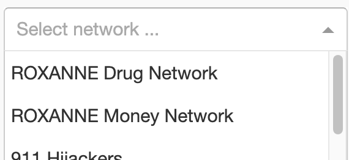


2. In the dropdown menu below select the entities you are interested in. You can filter the available entities by typing what you are looking for. You can select one or multiple entities or leave this field blank if you want to load the entire network. 

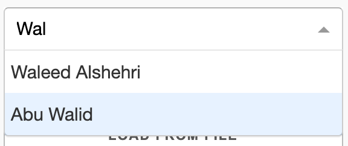


3. Press the `LOAD NETWORK` button to load the selection. All selected entities are displayed as well as all entities to which an outgoing edge exists from your selected entities. 

   

**Explore the network**

The network should be displayed now. Entities ( = nodes) are represented by circles with edges representing the links between them. Entities can be repositioned by clicking and dragging. When hovering over entities or edges their information is displayed on the right side. Entities with a plus sign on top are expandable - means they have outgoing links not yet displayed.

To expand an expandable entity click it first. A red border around an entity means it is selected. You can select multiple entities at once. Now, click the `EXPAND NODE(S)` button on the bottom right to expand the selected nodes. 


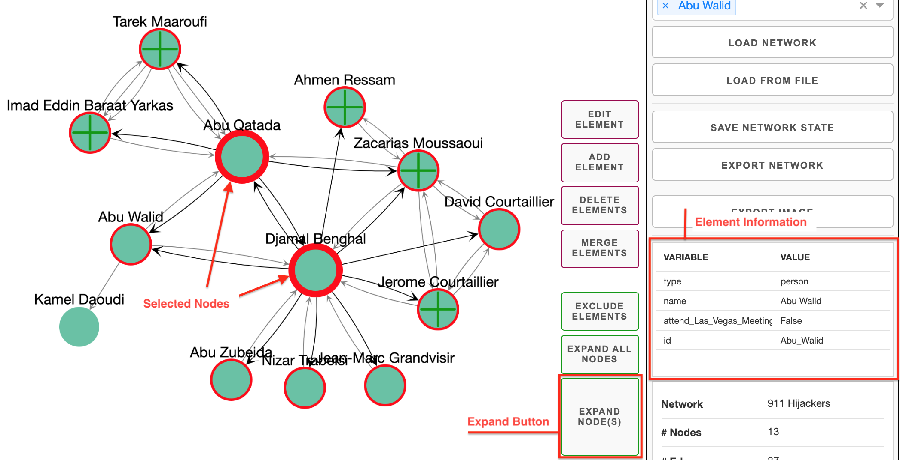


**Apply Network Analysis**

To apply any network analysis, switch to the `ANALYSIS` tab on the top right. In the uppermost dropdown select the analysis function to apply. In the one below choose an according algorithm. For some of the algorithms parameters can also be selected. Community detection and social influence analysis are applied on the whole network while link prediction is applied to the currently selected nodes. Click `ANALYZE` when analysis function and algorithm are  selected. 

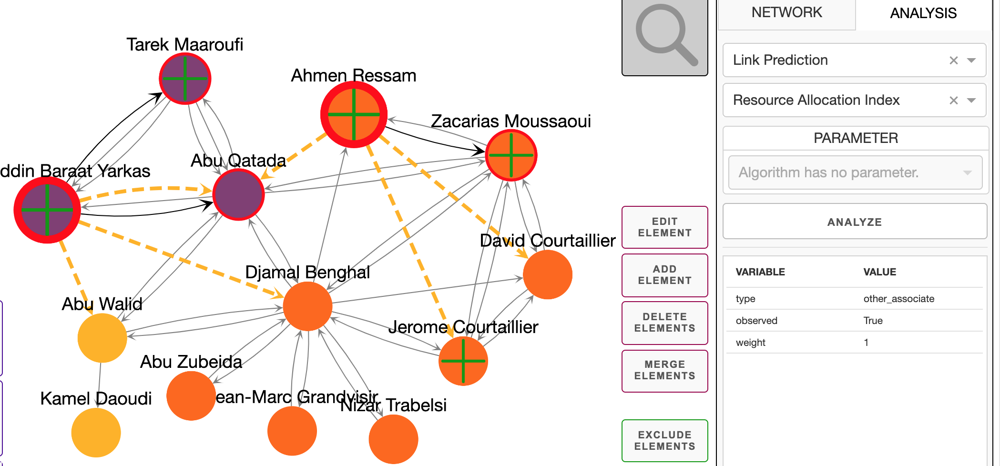

<p style="text-align: center;"> <i> Applying community detection and link prediction</i> </p>	

​																					

**Export Results**

To export the network go back to the `NETWORK` tab. Click `EXPORT IMAGE` and choose a image format in the presented dialog. Press `DOWNLOAD`to download the image to your local disk. *For export of the current network or saving of the current state see full documentation under [Export and Save the Network](#export-and-save-network).*


----


## Server


> :information_source: All files referenced in this section are located in the `visualizer` module of the of L3S's system for social network analysis.


**Dependencies** 

All dependencies are listed in the `requirements.txt` and can be installed using `pip install -r requirements.txt`.

> :warning: At the time where this documentation was written, the `requirements.txt` may contain some unused dependencies or even unavailable ones. If the `requirements.txt` doesn't work, you may need to install required packages manually.


**Run Server** 

Start the server by running `index.py` using Python 3. 


**Arguments**

The server may be run with the following optional arguments:

```bash
python index.py [-h] [--data DATA] [--debug] [--host HOST]
```

​	

> ​    `--data`:    Expects a local directory which contains network files in the L3S network format. The containing networks are available for loading at the network selection dropdown (see [Load Network](#load-network)).
>
> ​	`--debug`:   Set this flag to start the server in debug mode.
>
> ​	`--host`:	 Expects an IP address. The server is run on the given host. 


> :warning: **Regarding the L3S network format**: The format is used by the whole L3S social network analysis system and not exclusive to the visualizer. For documentation of the format look for the general L3S social network analysis systems documentation.


-----


## User Interface


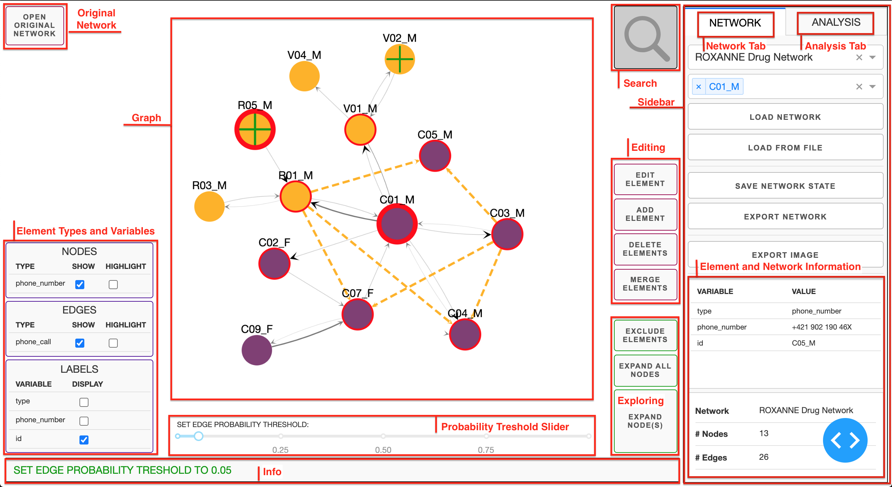

<p style="text-align: center;"> <i> The visualizer user interface and its components as referred to in this documentation</i> </p>													


---


### Sidebar

The sidebar contains everything related to loading, saving and exporting a network in the [Network Tab](#network-tab), the network analysis tools in the [Analysis Tab](#analysis-tab) and  [Element and Network Information](#element-and-network-information).


---


#### Element and Network Information

**Element Information**

When hovering over nodes or edges information about the element is displayed here.

> :warning: **Known Bug**: There is a known bug where information doesn't get updated when you first hover over a entity, then over an edge and then over the same entity again. Until fixed, it is required to hover over **another** entity before hovering over the original entity again.


**Network Information**

The name of the network as well as number of nodes and edges is shown here. When altering the network, this information gets updated.


---


#### Network Tab


##### Load Internal Network

Internal networks can be loaded using the `LOAD NETWORK` button after selecting a network and optionally some entities to load.


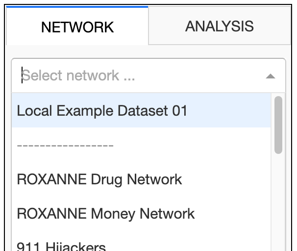		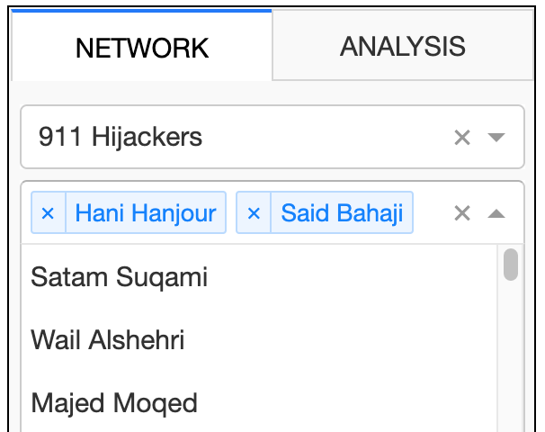

​							*Selecting a network and some entities to load*


**Select Network**

Use the `Select network ...` dropdown, to select one of the visualizers inbuilt networks. If a local directory is defined when starting the server using `--data` (see [Server](#server)), the local networks are loaded and displayed here at the top. You can load the whole network by leaving the `Select entities...` selection blank.

> :warning: **Loading huge networks**: The visualizer is not build for loading, displaying and exploring huge networks with thousands upon thousands of nodes or edges at once. Large networks may take some time to load or even make the browser throw an time out exception in extreme cases.


**Select Entities**:

Optionally, specific entities can be chosen before loading the network. These are listed by their `name` or `label` or alternatively by their `ID` if those are not specified in the dataset. The dropdown menu is searchable. When a network is loaded with entitites selected, the selected entities as well as all entities connected to the selected entities by an outgoing edge are initially displayed. 

> :information_source: **Regarding Large Networks**: Choosing specific entities to start exploration of a network with should be the prefered approach when dealing with large networks.


---


##### Load External Network

The `LOAD FROM FILE` Button opens the systems dialog to load a local dataset. The selected data is assumed to be either a file in the L3S network format (*see L3S social network analysis system documentation*) or a save file obtained by using the [Save Network State](#save-network-state) functionality described below. 

> :information_source: **Add external network as internal network**:  Networks can be added to the internal networks by specifying a directory containing network files using the command line argument `--data DATA` (see [Server](#server)). This also allows loading partial networks by selecting entities which is not possible using the `LOAD FROM FILE` feature. 


---


##### Export and Save Network

Current work can be saved and the network can be exported to file or an image using the buttons located below the `LOAD FROM FILE` button in the network tab of the sidebar. 


> :warning: **Reloading resets the current state of work!** 
>
> If you work with a network (inbuilt or external), the current state only exists in memory. No changes are stored persistently. The only way to save the results of working with the visualizer is using the features explained in this section.
>
> The current state of the visualizer does not save the state between browser sessions. If the visualizer is reloaded, the current state is lost. 


**Save Network State**:

The `SAVE NETWORK STATE` button creates a save file which includes all information about the current state of a network's visualization and allows the user to continue to work with the network later on. 


**Export Network File**:

The `EXPORT NETWORK` button exports a file in the official L3S network format (*see L3S social network analysis system documentation*).


> :information_source: **Saving vs. Exporting**:
>
> There are two main differences between exporting and saving a network:
>
> **a) Format**: While the file received when exporting a network is in the official L3S network format, the one obtained by saving is in another, internal format. This is necessary to make **b)** possible.
>
> **b) Network Information**: When exporting a network, the exported file represents the network as it was *seen* by the user in the user interface. Unexpanded nodes and edges are *not* included in the exported network. The file obtained by saving the network does retain all information about the whole network as well as the currently visible state of the network.


**Export Image**:

Images of the network visualization can be exported using the `EXPORT IMAGE` button. When pressing the button the user is presented with a dialog where an image format has to be chosen.


---


#### Analysis Tab

The `ANALYSIS` tab of the sidebar allows the user to apply network analysis algorithms to the currently visible network. The analysis results are visually applied to the network. 


> :information_source: **Altering an analyzed network**: When expanding, adding or removing nodes (or edges), the analysis results are automatically removed and need to be reapplied. This is only logical, because earlier network analysis probably is not valid for an altered network anymore.


These are the steps needed to execute network analysis: 

1. Choose an **analysis function** from the first drop down. 
2. Choose a specific **algorithm** to perform.
3. Some algorithms also allow the user to set **parameters**.


> :warning: **Info about the algorithms**: Information about the implementation of the available analysis algorithms are not yet part of this documentation but will probably added at some point. You may also want to look at the L3S's socials network analysis documentation for more information. 


<u>**Community Detection**</u>


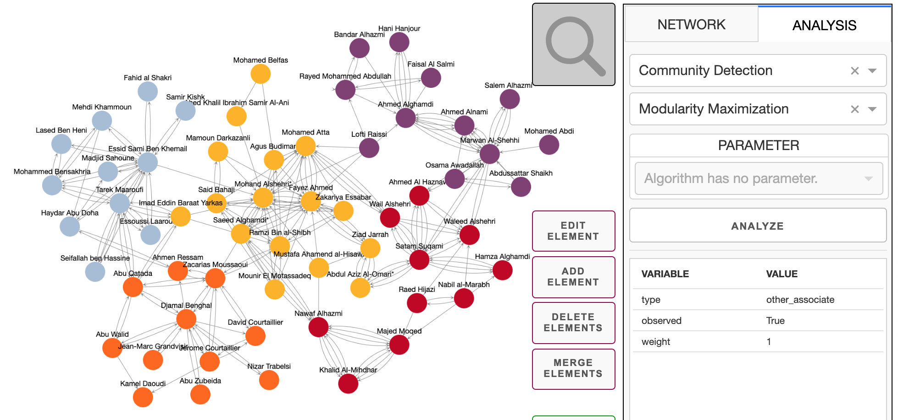


<p style="text-align: center;"> <i>Applying community detection using modularity maximization on a network</i> </p>	

Community detection algorithms are visualized by colouring entities of the same community in the same colour. Some algorithms allow entities to remain unassigned to any community. These Entities remain coloured in the default colour. 


<u>**Social Influence Analysis**</u>


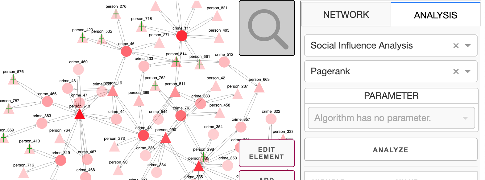

<p style="text-align: center;"> <i>Applying social influence analysis using pagerank on a network</i> </p>	

Social influence is visualized by using the nodes opacity: The darker a node, the stronger is its influence in the network according to the applied algorithm. 


**<u>Link Prediction</u>**


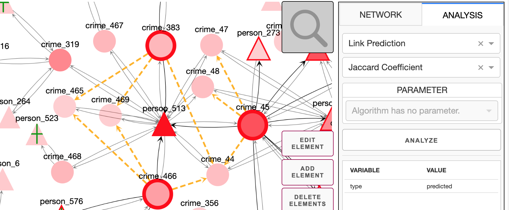

<p style="text-align: center;"> <i>Applying link prediction on three selected entities using Jaccard Coefficient</i> </p>	

Link prediction is a little different from social influence analysis and community detection. First of all, at least one entity needs to be selected (by clicking on them) before applying link prediction. The three most likely links are then displayed by a dotted yellow line for each selected entity. It is also possible to apply link prediction why keeping the results of community detection or social influence analysis. 

>:warning: You should be aware of the fact, that in contrast to community detection and social influence analysis elements get repositioned when applying link prediction. Especially when working with a bigger network this  potentially means a significant loss of oversight. Unfortunately, There is currently no easy solution to this.


---


### Main Frame


---


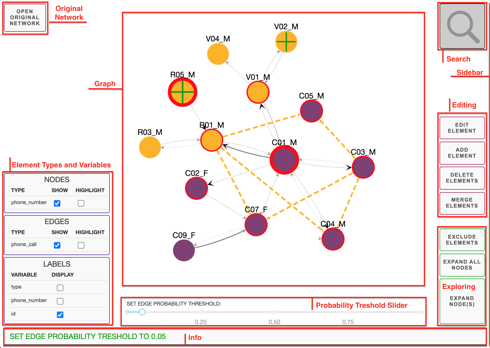

<p style="text-align: center;"> <i>This is the main frame of the visualizer - primarily containing the visualization of the network itself and means to edit and explore it</i> </p>


---


#### Graph

This is the area of the visualizer which contains the visualization of the network. 


**Nodes Visualization**:

Each node is initially displayed with a label attached to it. If the underlying dataset contains a `label` or `name` field, the content of that field is used. Otherwise it uses the `id` field (*see [Element Types and Variables](#element-types-and-variables) on how to change which labels are displayed*). The appearance of nodes is determined by their `type` property: Different *types* of nodes are visualized using different shapes and colours. 

Expandable nodes are marked by having a green plus sign on top of itself. A node is expandable if it has outgoing edges to nodes not yet displayed by the visualizer. 


**Edge Visualization**:

If there is a `probability` or `weight` property attached to an edge, the thickness of an edges depend on the value of that property. Everything else is pretty much self explanatory.


**Graph Interactivity**

There are basically two main interactions with the graph: *Click & Drag* and *Click*.

Nodes can be moved around by clicking and dragging them to the desired position. It is also possible to drag the whole window. Furthermore, nodes and edges can be clicked, which changes their visual appearance and allow for further interaction with the *selected* element(s). Clicking nodes also highlights neighbouring nodes and outgoing edges.


> :information_source: The position of elements is recomputed every time a new element is added to or removed from the  network. This includes simple tasks such as expanding a node. While this is not ideal in terms of keeping an overview of the network at hand, there is currently no easy solution to this. This may be changed in a future release of the visualizer. 


---


#### Info

The info area informs the user about their performed interactions, mishandling of the system such as missing inputs or more critical errors of the system.


---


#### Searching

> :warning: **Disabled**: Implementation of an in depth network search is being worked on but disabled until fully working. 


---


#### Original Network


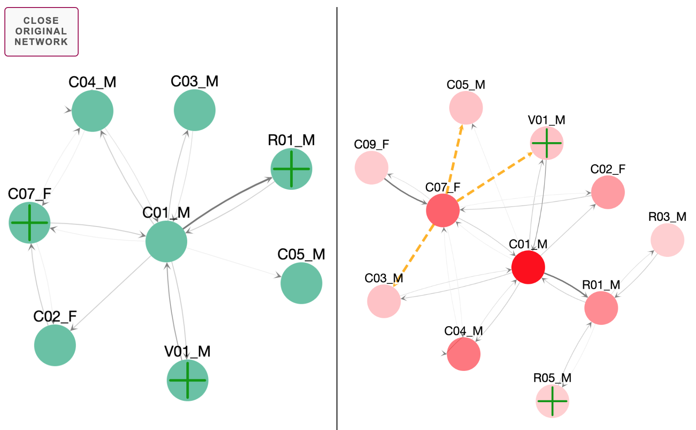

<p style="text-align: center;"> <i>Visualizer with the original network open for comparison</i> </p>


The `OPEN ORIGINAL NETWORK` button splits the screen and displays the network in the original state next to the main network. Being in the *original state* means, the network is in exactly the state it was in when it was first loaded. All changes done do the network in the main windows are not adopted in the *original network*. Some elements of the GUI are hidden while the *original network* is open. 

The *original network* can be dragged around and nodes can be repositioned but no other changes can be made to this network. The `CLOSE ORIGINAL NETWORK` button closes the original network view and brings the main network area back to full size. 

> :information_source: Due to a random factor in the layout function used to position elements, the original network may be positioned different than the main network. This may be changed in the future. 


---


#### Probability Threshold Slider


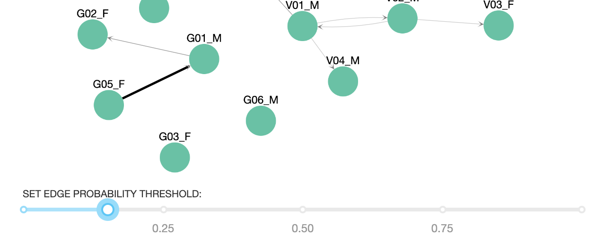

<p style="text-align: center;"> <i>Probability threshold set to 0.15 - links with a lower probabiblity or hidden.</i> </p>


If the network dataset provides probabilities for its edges a probability threshold slider is presented below the network visualization. This slider can be used to hide edges below a certain threshold value. Only edges above the threshold are displayed.


---


#### Element Types and Variables


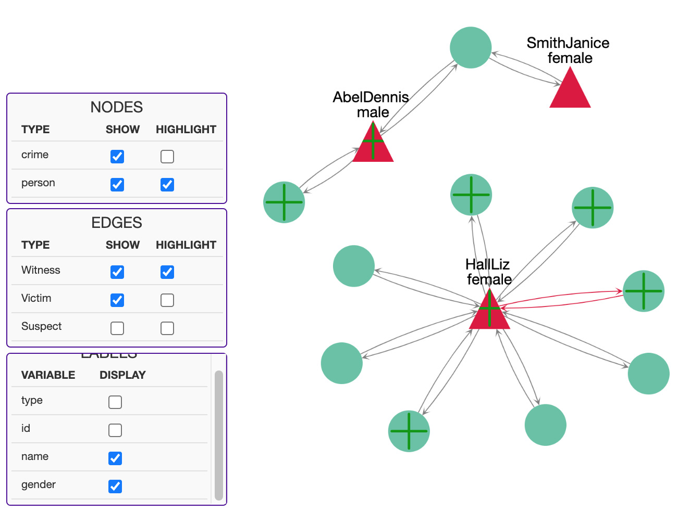

<p style="text-align: center;"> <i>Using the Element Types and Label Variables feature to hide edges of a certain type, highlight some node and edge types and displaying data variables above the nodes.</i> </p>


The controls at the bottom left allow hiding and highlighting node and edge types as well as selecting the variables to be displayed above the nodes in the visualization. Element types are defined in the underlying network dataset with the `type` field. All node variables/properties present in the underlying dataset can be displayed as labels using the undermost of the three boxes. 


---


#### Exploring

The three buttons with the green border on the right hand side of the network graph are used to explore the network.  These features only change what is visible to the user and *do not* alter the underlying network itself. 

**Expand node(s)**: The `EXPAND NODE(S)` button expands all nodes which are currently selected. When a node *n* is expanded, all nodes which are connected by an outgoing edge from *n* are added to the visualization. All edges connecting now present nodes are also displayed. 

**Expand all nodes**: Pressing the `EXPAND ALL NODES` button expands all currently expandable nodes as described above.

**Exclude elements**: `EXCLUDE ELEMENTS` excludes all currently selected nodes and/or edges from the visualization. Nodes excluded this way can be expanded again using the features described above.


---


#### Editing

> :warning: **Editing changes the underlying network!** All features described below alter the underlying network. Changes done this way can not be undone without reloading the network. These features are intended for permanent editing of a network.


The four red bordered buttons on the right hand side of the network graph can be used to edit the network. Most of these features require the nodes or elements being selected to be performed.


**Edit element**


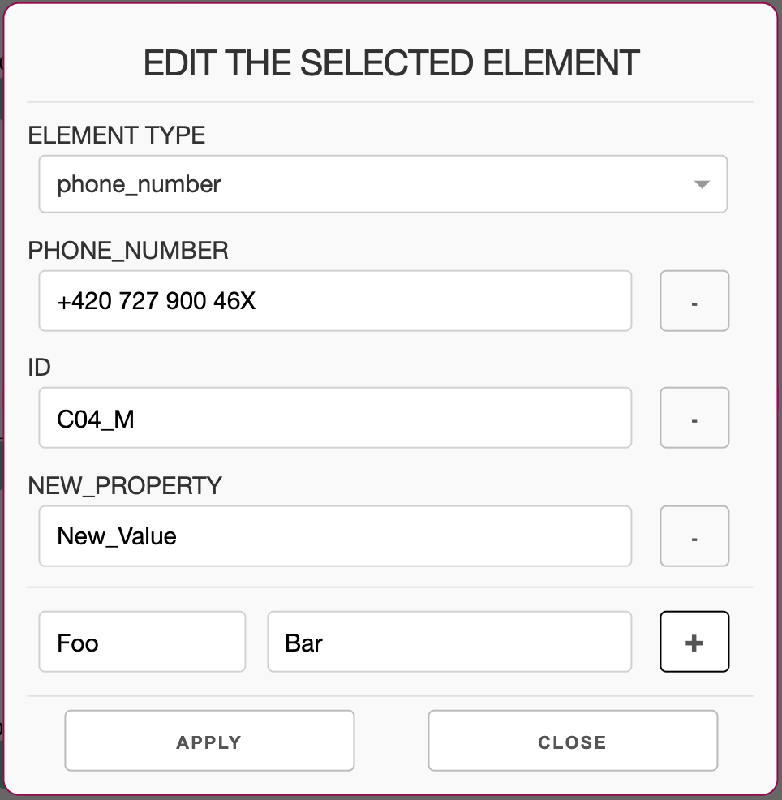

<p style="text-align: center;"> <i>Dialog for editing an element</i> </p>


Select a *single* element (node or edge) first. Clicking the `EDIT ELEMENT` button then opens a dialog which allows editing of the selected element. The *element type* cannot be removed and can only be chosen from already existing types. All other properties may be removed using the `-` buttons at the right or changed using the value fields. It is also possible to add new properties to the element by using the two fields at the bottom (variable/property: left field; value: right field) and the `+` button to the right. Press `APPLY ` to apply the changes and return to the main window.


**Add element**


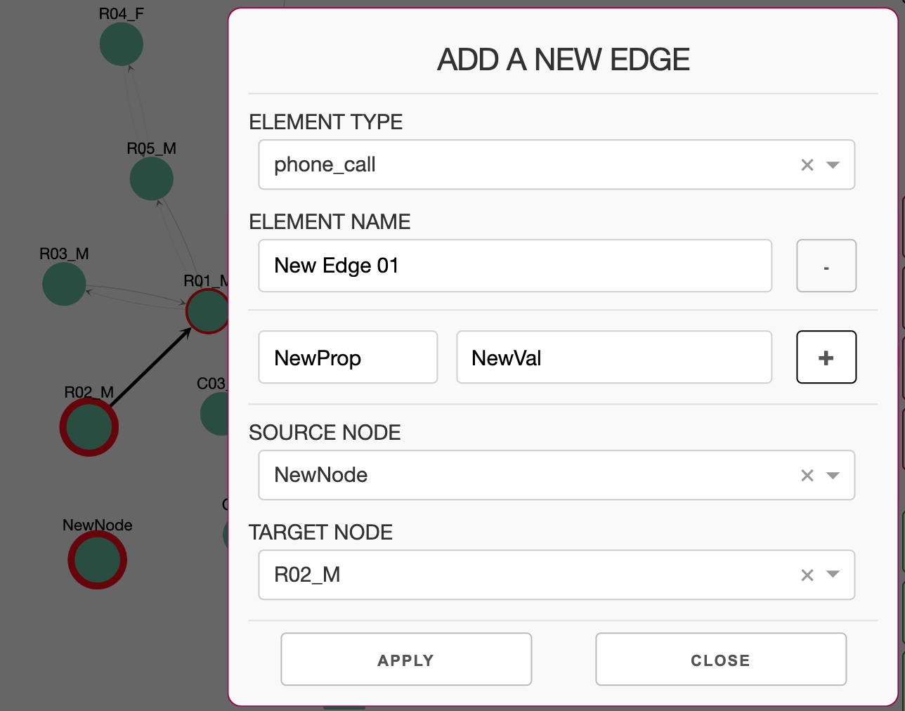

<p style="text-align: center;"> <i>Adding a new edge</i> </p>

#### 

When clicking the `ADD ELEMENT` button the type of element has to be chosen first. When choosing to add a new node, a windows similar to the one described in the [Edit element](#edit-element) section above pops up. When adding a new edge, there are additional fields for selecting the *source node* and the *target node*. These have to be selected from a list of all existing nodes. The dropdowns allow searching for node names as described in the [Select Entities](#select-entities) section. Alternatively, select the two nodes between which the new edge shall be added before opening the `ADD ELEMENT` dialog.


**Delete elements**

Pressing `DELETE ELEMENTS` deletes every element currently selected. Nodes removed this way can not be re-expanded.


**Merge elements**

> :warning: **Merging edges not available yet.** 

To elements select two or more elements of the same kind and press the `MERGE ELEMENTS` button. The dialog presented is similar to the one explained in the [Edit element](#edit-element) section. When applied, all selected elements are merged to one element with the properties entered in the merge elements dialog. 


